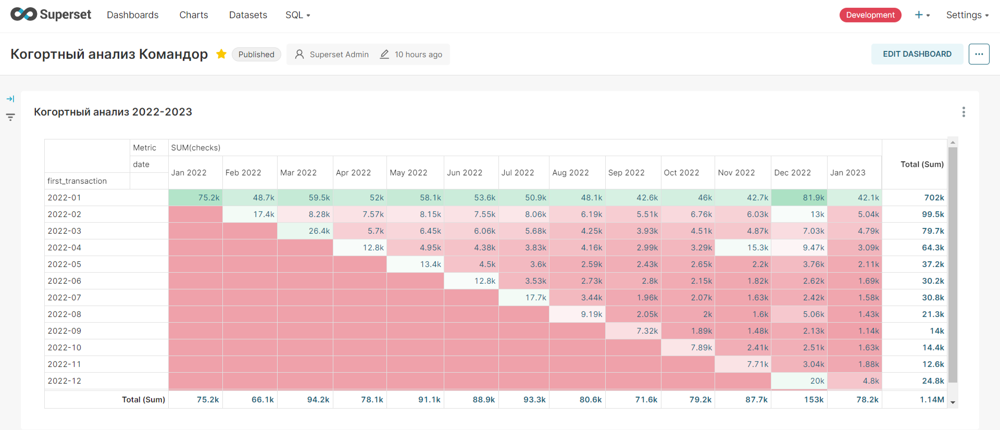

# Телеграм бот

[tbot.py](tbot.py)

Файл 
[telegram.ini](telegram.ini) вынести выше уровнем и настроить токен или задать токен в основном файле

## Для работы необходимо
```
pip install configparser
pip install pyTelegramBotAPI
```

имя бота 
@komandor_nata44845_bot

Настройки бота на сервере
[tbot.service](tbot.service)

Поместить в /usr/lib/systemd/system
```
sudo systemctl daemon-reload
sudo systemctl enable tbot.service
```
Команды запуска
```
sudo systemctl start tbot.service
sudo systemctl stop tbot.service
sudo systemctl status tbot.service
```

# Когортный анализ
Файл data.csv

Исследование данных
[explore.ipynb](explore.ipynb)

Ссылка на дашбоард 
http://195.19.93.83:8088/superset/dashboard/http1951993838088komandor/



Вывод, лучше всего себя показывает когорта января 2022